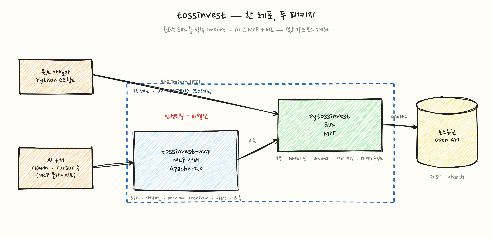
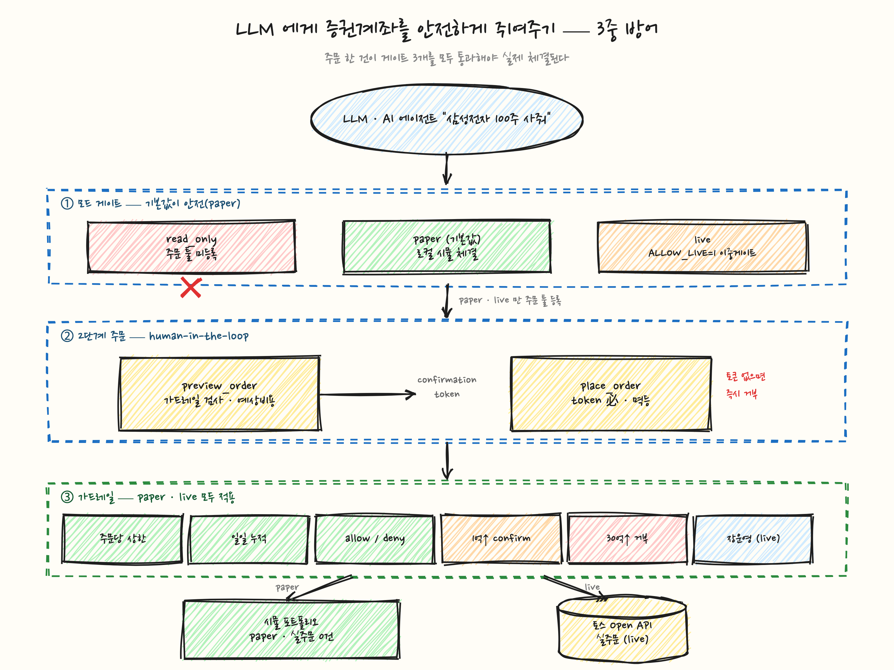
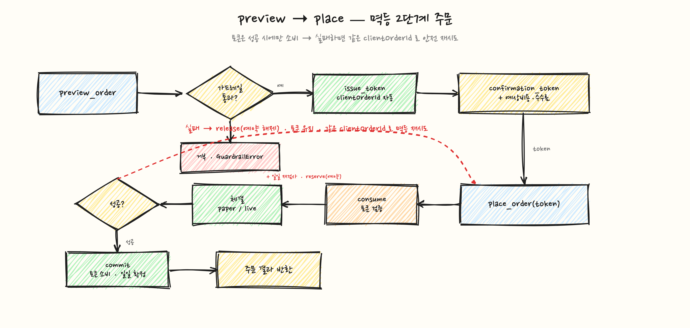

<div align="center">

# 🪙 tossinvest

### 토스증권 Open API 를 AI·퀀트에 연결하는 오픈소스

decimal·레이트리밋·멱등성까지 제대로 다룬 **SDK** + LLM 에게 계좌를 *안전하게* 쥐여주는 **MCP 서버**


</div>



> ⚠️ **비공식(unofficial) 클라이언트** — 토스증권과 무관하고, 상표/엔도르스먼트와도 무관합니다. 토스 Open API 는 2026-06 기준 **사전신청 단계**라, 라이브 키 없이도 전부 만들고·테스트·데모할 수 있게 설계했습니다(paper 모드 + mock).

---

## 한 줄로

- **퀀트라면** → `pip install pytossinvest`, 파이썬에서 바로 잔고 조회·주문. *(SDK · MIT)*
- **AI 에 맡기려면** → MCP 클라이언트(Claude Desktop·Cursor)에 `tossinvest-mcp` 를 꽂으면 *"내 잔고 보여줘 / 삼성전자 5주 사줘 / 환율 추세 분석해줘"* 가 바로 됩니다. *(MCP 서버 · Apache-2.0)*

경계가 **SDK ↔ MCP** 로 깨끗하게 갈립니다. 퀀트는 SDK 만 쓰고, AI 유저는 그 위의 안전모델까지 받습니다.

---

## 왜 또 하나의 클라이언트인가

자동생성 래퍼는 토스 API 의 *함정*을 안 막아줍니다. 그래서 손으로, 제대로:

| | |
|---|---|
| 💸 **돈은 절대 float 가 아니다** | 금액·수량 전구간 문자열/`Decimal`. float 은 들어오는 순간 `TypeError` — 반올림으로 1원도 안 틀어집니다. |
| 🚦 **클라이언트단 레이트리미터** | 그룹별 토큰버킷 + **9시 개장 10분 ORDER/ORDER_INFO 반토막**(6→3) 반영. **`X-RateLimit-*` 헤더로 버킷 동기화**(헤더가 진실) + **429 bounded 자동 retry**(`Retry-After`/백오프+jitter, 5xx·타임아웃은 비재시도). |
| 🔁 **멱등성** | `clientOrderId` 자동 관리 — 네트워크 단절로 응답을 못 받아도 같은 키로 재시도해 **중복주문 방지**. |
| 🧩 **에러는 `code` 로 분기** | `message` 가 비어도 OK. 서버가 **모르는 코드/enum 을 추가해도 안 깨짐**. |
| 🔐 **토큰 생애주기** | 만료 전 갱신·메모리 캐싱, `401 expired-token` 시 1회 재발급 후 재시도. |
| ✅ **라이브 키 없이 그린** | `git clone && uv sync && pytest` → **144개 테스트** 통과. 기여 장벽 0. |

---

## 🔒 핵심 — LLM 에게 증권계좌를 *안전하게* 쥐여주기

이게 진짜 떡밥입니다. **"AI 가 멋대로 내 계좌를 질러버리면?"** 을 클라이언트 신뢰가 아니라 **서버단 가드레일**로 막습니다.



1. **모드 게이트 — 기본값이 안전.** `read_only`(주문 툴 아예 미등록) / **`paper`(기본 · 로컬 시뮬 체결, 실주문 0)** / `live`(실주문). live 는 `TOSSINVEST_MODE=live` **와** `TOSSINVEST_ALLOW_LIVE=1` 이 *둘 다* 있어야 켜집니다. 모드만 바꿔선 아무 일도 안 일어나요(fail-closed).
2. **2단계 주문 — human-in-the-loop.** `preview_order` 가 가드레일을 검사하고 예상비용과 함께 **짧게 유효한 토큰**을 발급. `place_order` 는 그 토큰 없이는 **거부**. LLM 이 한 방에 YOLO 매매 못 합니다. 정정(`modify_order`)도 `preview_modify`→토큰 게이트를 똑같이 거칩니다(정정 후 금액에 가드레일 적용).
3. **가드레일 — paper·live 모두.** 주문당/일일 누적 금액 상한(**통화별** — KRW/USD 분리) · 종목 allow/deny · **고액 명시적 확인 필수**(KRW 1억 / USD $100k↑) · **하드 실링 즉시 거부**(KRW 30억 / USD $3M↑) · 장운영시간(live).

> **불변식:** 체결 경로는 **반드시** 가드레일을 통과합니다. 토큰은 `preview_order` 에서만, 가드레일 통과 후 발급돼요. 우회 경로가 없습니다.

---

## 2단계 주문 흐름 — preview → place, 그리고 멱등성



토큰은 **성공했을 때만** 소비됩니다. 그래서 `place_order` 가 도중에 실패하면 토큰이 살아있고, **같은 `clientOrderId` 로 안전하게 재시도** — 두 번 체결되는 일이 없습니다. 성공하면 토큰이 사라져 두 번 발사도 못 하고요.

---

## 빠른 시작

### SDK — 파이썬에서 바로

```python
from pytossinvest import TossInvestClient

with TossInvestClient(client_id="...", client_secret="...") as c:
    c.get_accounts()                     # accountSeq 자동 캐싱 (ACCOUNT 1/s)
    prices = c.get_prices(["005930"])
    print(prices[0].last_price)          # Decimal("70000") — 절대 float 아님

    # 주문은 문자열-decimal + 멱등(clientOrderId 직접 부여)
    c.place_order(symbol="005930", side="BUY", order_type="LIMIT",
                  price="70000", quantity="10", client_order_id="my-001")
```

### MCP — Claude Desktop 에 꽂기

`claude_desktop_config.json`:

```json
{
  "mcpServers": {
    "tossinvest": {
      "command": "uv",
      "args": ["run", "--directory", "/path/to/tossinvest",
               "--package", "tossinvest-mcp", "tossinvest-mcp"],
      "env": {
        "TOSSINVEST_MODE": "paper",
        "TOSSINVEST_CLIENT_ID": "...",
        "TOSSINVEST_CLIENT_SECRET": "..."
      }
    }
  }
}
```

기본 `paper` 라 실주문은 0건 — 안심하고 *"삼성전자 10주 미리보기 해줘"* 부터 시켜보세요. 실거래로 가려면 `TOSSINVEST_MODE=live` + `TOSSINVEST_ALLOW_LIVE=1`.

> ⚠️ **live 는 *자동승인* MCP 클라이언트와 같이 쓰지 마세요.** preview→place 2단계는 *사람이 각 호출을 승인*한다는 전제입니다. 클라이언트가 툴 호출을 자동 승인하면 LLM 이 한 턴에 preview→place 를 연달아 쏴 사람이 못 낍니다. 추가 방어로 `tossinvest-mcp` 의 `LIVE_CONFIRM_MIN_DELAY_SEC` 를 쓸 수 있습니다.

---

## 모드 한눈에

| 모드 | 주문 | 동작 | 켜는 법 |
|---|:---:|---|---|
| `read_only` | ✗ | 읽기만, 주문 툴 미등록 | `TOSSINVEST_MODE=read_only` |
| **`paper`** *(기본)* | ○ | 로컬 시뮬 포트폴리오 체결, **실주문 0** | (기본값) |
| `live` | ○ | 실주문 | `MODE=live` **+** `ALLOW_LIVE=1` |

## MCP 툴 (14개)

- **읽기 (항상):** `get_accounts` · `get_holdings` · `get_quote` · `get_candles` · `get_stock_info` · `get_market_info` · `list_orders` · `get_order`
- **쓰기 (paper·live):** `get_order_readiness` · **`preview_order` → `place_order`** · **`preview_modify` → `modify_order`** · `cancel_order`

가드레일 한도·종목 allow/deny·시작 현금 등은 전부 env 로 조절합니다 → [`tossinvest-mcp/README.md`](tossinvest-mcp/README.md).

---

## 한 레포, 두 패키지

| 패키지 | 역할 | 라이선스 | 의존 |
|---|---|:---:|---|
| [`pytossinvest`](pytossinvest/) | 토스 Open API Python SDK | **MIT** | — |
| [`tossinvest-mcp`](tossinvest-mcp/) | 안전모델을 얹은 MCP 서버 | **Apache-2.0** | `pytossinvest` |

`uv` 워크스페이스 모노레포라, 둘은 한 레포에서 따로 빌드·배포됩니다.

```bash
# 테스트 — 라이브 키 불필요
uv run --package pytossinvest --extra dev pytest pytossinvest/tests   # 46 passing
uv run --package tossinvest-mcp pytest tossinvest-mcp/tests           # 98 passing
```

더 깊은 문서는 [`docs/claude/`](docs/claude/) — [API 레퍼런스](docs/claude/tossinvest-open-api.md) · [SDK 내부구조](docs/claude/pytossinvest-sdk.md) · [MCP 안전모델](docs/claude/tossinvest-mcp.md).

---

## 상태 & 면책

- **사전신청 단계** — 토스 Open API 정식 오픈일 미정(2026-06 기준). 한도·정책·엔드포인트가 바뀔 수 있어요. 레퍼런스 문서는 스냅샷이고, canonical `openapi.json` 이 진실입니다.
- **본인 키로 본인 계좌를 직접 돌리는 도구**입니다. 남의 계좌 대리매매·유료 매매신호 제공은 만들지 않습니다(규제 회피 아니라 의도적 비목표).
- 투자 판단과 그 결과는 전적으로 본인 책임입니다.

## 라이선스

SDK(`pytossinvest`) = **MIT** · MCP 서버(`tossinvest-mcp`) = **Apache-2.0**. 각 패키지 디렉터리의 `LICENSE` 참고.
